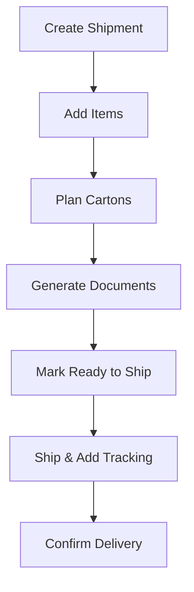

# Export Workflow Guide

This guide walks through the complete shipment process—from creating a new shipment to confirming delivery.

---

## Workflow Overview

---

## Step 1: Create Shipment

**Location:** Sidebar → Exports → **+ New Shipment**

<Steps>
  <Step title="Click + New Shipment">
    Opens the new shipment form
  </Step>
  <Step title="Select shipment type">
    - **Sample**: Shipping samples only
    - **Production**: Shipping production orders only
    - **Mixed**: Both samples and production
  </Step>
  <Step title="Select customer">
    Choose from dropdown
  </Step>
  <Step title="Select transport method">
    - Air Freight
    - Sea Freight
    - Courier
  </Step>
  <Step title="Enter dates">
    - Planned ship date
    - Expected delivery date
  </Step>
  <Step title="Add notes (optional)">
    Any special instructions
  </Step>
  <Step title="Click Create">
    Shipment is created in Draft status
  </Step>
</Steps>

### Form Fields

| Field | Required | Description |
|-------|----------|-------------|
| Shipment Type | Yes | Sample / Production / Mixed |
| Customer | Yes | Select customer |
| Transport Method | Yes | Air / Sea / Courier |
| Ship Date | No | Planned dispatch date |
| Delivery Date | No | Target arrival date |
| Notes | No | Special instructions |

<Info>
**What the system does:**
- Creates shipment record
- Assigns status: **Draft**
- Opens Shipment Detail page
</Info>

---

## Step 2: Add Items

**Location:** Shipment Detail → Items tab → **Add Items**

<Steps>
  <Step title="Click Add Items">
    Opens item selection dialog
  </Step>
  <Step title="Choose item type">
    Sample or Production Order (based on shipment type)
  </Step>
  <Step title="Search for items">
    By reference number (SMP-/PRD-) or style name
  </Step>
  <Step title="Select items">
    Check items to include
  </Step>
  <Step title="Click Add">
    Items added to shipment
  </Step>
</Steps>

### What You Can Add

| Shipment Type | Can Add |
|---------------|---------|
| Sample | Samples only |
| Production | Production orders only |
| Mixed | Both samples and production orders |

<Warning>
Each item can only be in one shipment. If an item is already in another shipment, it won't appear in the search results.
</Warning>

---

## Step 3: Change Status to Planning

**Location:** Shipment Detail → Header → Status dropdown

<Steps>
  <Step title="Click current status badge">
    Opens status dropdown
  </Step>
  <Step title="Select Planning">
    Status changes to Planning
  </Step>
</Steps>

<Info>
Changing to Planning status indicates you're actively working on carton arrangements and preparation.
</Info>

---

## Step 4: Plan Cartons

**Location:** Shipment Detail → Cartons tab → **Plan Cartons**

<Steps>
  <Step title="Go to Cartons tab">
    Click Cartons in tab bar
  </Step>
  <Step title="Click Add Carton">
    Create first carton
  </Step>
  <Step title="Set carton dimensions">
    Enter Length × Width × Height (cm)
  </Step>
  <Step title="Add items to carton">
    Drag items or use Add Items button
  </Step>
  <Step title="Repeat for all items">
    Create more cartons as needed
  </Step>
  <Step title="Check efficiency">
    Target 90%+ overall efficiency
  </Step>
</Steps>

### Carton Fields

| Field | Description |
|-------|-------------|
| Carton Number | Auto-assigned (1, 2, 3...) |
| Dimensions | L × W × H in cm |
| Max Weight | Weight limit in kg |
| Items | What's packed inside |

See [Carton Planning Guide](/exports/carton-planning) for detailed instructions.

---

## Step 5: Generate Documents

**Location:** Shipment Detail → Documents tab

<Steps>
  <Step title="Go to Documents tab">
    Click Documents in tab bar
  </Step>
  <Step title="Generate Packing List">
    Click Generate → Review → Download
  </Step>
  <Step title="Generate Commercial Invoice">
    Click Generate → Review → Download
  </Step>
  <Step title="Upload external documents">
    Certificate of Origin, Bill of Lading (if required)
  </Step>
</Steps>

### Documents Checklist

| Document | Generated By | Required |
|----------|--------------|----------|
| Packing List | System | Yes |
| Commercial Invoice | System | Yes |
| Certificate of Origin | External | Depends on destination |
| Bill of Lading | Carrier | For sea freight |

See [Documents Guide](/exports/documents) for document details.

---

## Step 6: Mark Ready to Ship

**Location:** Shipment Detail → Header or Status dropdown

<Steps>
  <Step title="Verify all items are added">
    Check Items tab
  </Step>
  <Step title="Verify cartons are planned">
    Check Cartons tab
  </Step>
  <Step title="Verify documents generated">
    Check Documents tab
  </Step>
  <Step title="Change status to Ready to Ship">
    Click status dropdown → Ready to Ship
  </Step>
</Steps>

### Pre-Shipment Checklist

Before marking Ready to Ship, verify:

- [ ] All items added to shipment
- [ ] All items assigned to cartons
- [ ] Carton efficiency is acceptable (90%+)
- [ ] Packing list generated
- [ ] Commercial invoice generated
- [ ] External documents uploaded (if required)
- [ ] Customer details correct
- [ ] Delivery date confirmed

---

## Step 7: Ship and Add Tracking

**Location:** Shipment Detail → **Mark Shipped** button

<Steps>
  <Step title="Click Mark Shipped">
    Opens shipping details form
  </Step>
  <Step title="Enter carrier">
    DHL, FedEx, Maersk, etc.
  </Step>
  <Step title="Enter tracking number">
    AWB or tracking reference
  </Step>
  <Step title="Enter ship date">
    Actual dispatch date
  </Step>
  <Step title="Confirm">
    Status changes to Shipped
  </Step>
</Steps>

### Shipping Fields

| Field | Required | Description |
|-------|----------|-------------|
| Carrier | Yes | Shipping company |
| Tracking Number | Yes | AWB or reference |
| Ship Date | Yes | Actual dispatch date |
| Expected Arrival | No | Estimated delivery |

<Info>
**What the system does:**
- Changes status to **Shipped**
- Logs shipping details
- Records timestamp and user
</Info>

---

## Step 8: Confirm Delivery

**Location:** Shipment Detail → **Mark Delivered** button

<Steps>
  <Step title="Wait for delivery confirmation">
    Customer confirms receipt
  </Step>
  <Step title="Click Mark Delivered">
    Opens delivery confirmation
  </Step>
  <Step title="Enter actual arrival date">
    Date customer received goods
  </Step>
  <Step title="Confirm">
    Status changes to Delivered
  </Step>
</Steps>

<Info>
**What the system does:**
- Changes status to **Delivered**
- Marks shipment as complete
- Logs delivery date
</Info>

---

## Common Scenarios

| Situation | Action |
|-----------|--------|
| Need to add forgotten item | Items tab → Add Items (must be Draft or Planning status) |
| Item doesn't fit in carton | Create new carton, reassign item |
| Need to change transport method | Edit button → Update transport method |
| Customer changed delivery date | Edit button → Update delivery date |
| Document shows wrong info | Check source items, regenerate document |
| Need to cancel shipment | Contact admin to change status |
| Shipment was returned | Create new shipment or contact admin |

---

## Status Summary

| Status | What You Can Do | What's Locked |
|--------|-----------------|---------------|
| Draft | Edit everything, add/remove items | Nothing |
| Planning | Edit details, plan cartons, add/remove items | Nothing |
| Ready to Ship | Generate documents, mark shipped | Items, cartons |
| Shipped | Add tracking updates, mark delivered | Most fields |
| Delivered | View only | Everything |

---

## Troubleshooting

<AccordionGroup>
  <Accordion title="Can't change status to Ready to Ship">
    **Cause:** Missing items, cartons, or documents.

    **Solution:** Complete all required steps:
    1. Add at least one item
    2. Plan cartons for all items
    3. Generate required documents
  </Accordion>

  <Accordion title="Can't add items">
    **Cause:** Shipment status is Ready to Ship or later.

    **Solution:** Items can only be added in Draft or Planning. Contact admin if status needs to be reverted.
  </Accordion>

  <Accordion title="Item won't appear in search">
    **Cause:** Item is already in another shipment, or doesn't match shipment type.

    **Solution:**
    1. Check if item is in another shipment
    2. Verify shipment type allows this item type
  </Accordion>

  <Accordion title="Documents won't generate">
    **Cause:** Missing required information.

    **Solution:**
    1. Verify items have values/costs set
    2. Check cartons are planned
    3. Verify customer information is complete
  </Accordion>

  <Accordion title="Wrong carrier/tracking entered">
    **Cause:** Data entry error.

    **Solution:** Go to Shipping tab → Edit tracking details (if status allows) or contact admin.
  </Accordion>
</AccordionGroup>

---

## Related Guides

<CardGroup cols={2}>
  <Card title="Shipment Detail Page" icon="rectangle-list" href="/exports/shipment-detail">
    Full page reference
  </Card>
  <Card title="Carton Planning" icon="box" href="/exports/carton-planning">
    Detailed carton guide
  </Card>
  <Card title="Documents" icon="file-pdf" href="/exports/documents">
    Document generation
  </Card>
  <Card title="Shipping" icon="truck" href="/exports/shipping">
    Tracking and delivery
  </Card>
</CardGroup>
