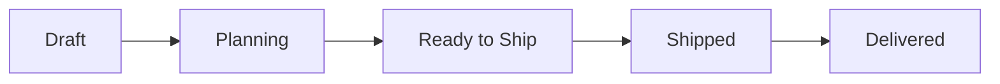

# Exports Overview

The Export Hub manages shipments to customers. Create shipments, plan cartons, generate export documents, and track delivery status.

---

## Shipment Types

| Type | When to Use |
|------|-------------|
| **Sample** | Shipping samples to customers for approval |
| **Production** | Shipping completed production orders |
| **Mixed** | Shipping both samples and production items together |

<Info>
Shipment type is set when creating the shipment. Choose based on what you're shipping.
</Info>

---

## Shipment Statuses

| Status | Meaning | How It's Set |
|--------|---------|--------------|
| Draft | Shipment created, not finalized | Automatic on creation |
| Planning | Adding items and planning cartons | Manual |
| Ready to Ship | Fully planned, documents generated | Manual |
| Shipped | Dispatched to customer | Manual (with tracking info) |
| Delivered | Customer received goods | Manual |

### Status Flow

---

## Navigation

**Location:** Sidebar → **Exports**

### Exports List Page

Shows all shipments with columns:

| Column | Description |
|--------|-------------|
| Shipment # | Reference number |
| Type | Sample / Production / Mixed |
| Customer | Customer name |
| Status | Current status |
| Items | Number of items |
| Ship Date | Planned or actual ship date |

### Filters Available

| Filter | Options |
|--------|---------|
| Status | Draft, Planning, Ready to Ship, Shipped, Delivered |
| Type | Sample, Production, Mixed |
| Customer | Select customer |
| Date Range | Ship date range |

---

## Key Features

<CardGroup cols={2}>
  <Card title="Shipment Management" icon="boxes-stacked">
    Create and manage shipments for samples and production orders
  </Card>
  <Card title="Carton Planning" icon="box">
    Plan how items fit into cartons with efficiency tracking
  </Card>
  <Card title="Document Generation" icon="file-pdf">
    Generate packing lists, commercial invoices automatically
  </Card>
  <Card title="Tracking" icon="location-dot">
    Track shipments from dispatch to delivery
  </Card>
</CardGroup>

---

## Quick Actions

| Action | Location |
|--------|----------|
| Create new shipment | Exports → + New Shipment |
| View shipment details | Click on shipment row |
| Plan cartons | Shipment Detail → Cartons tab |
| Generate documents | Shipment Detail → Documents tab |
| Mark as shipped | Shipment Detail → Mark Shipped button |

---

## Related Guides

<CardGroup cols={2}>
  <Card title="Shipment Detail Page" icon="rectangle-list" href="/exports/shipment-detail">
    Complete page guide
  </Card>
  <Card title="Complete Workflow" icon="route" href="/exports/complete-workflow">
    Step-by-step from creation to delivery
  </Card>
  <Card title="Carton Planning" icon="box" href="/exports/carton-planning">
    Planning cartons and efficiency
  </Card>
  <Card title="Documents" icon="file-pdf" href="/exports/documents">
    Generating export documents
  </Card>
</CardGroup>
