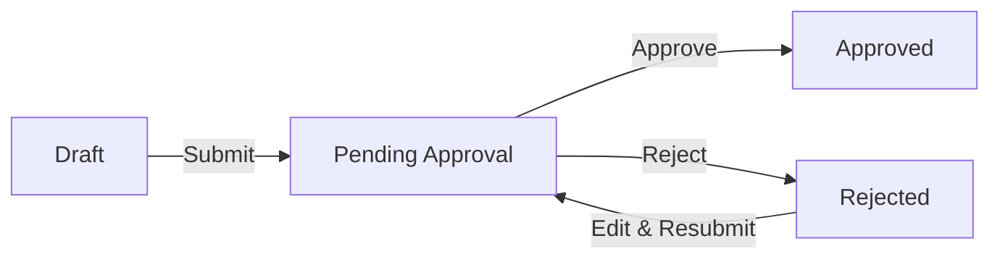

# Approval Workflow

Purchase orders require approval before they can proceed. This guide explains how approval limits work, how to submit POs for approval, and how approvers process requests.

---

## How Approval Works

1. Creator submits PO for approval
2. System routes to appropriate approver based on amount
3. Approver reviews and approves or rejects
4. If rejected, creator can edit and resubmit

---

## Approval Limits

Approvers are assigned authorization limits. A PO can only be approved by someone with a limit equal to or higher than the PO total.

### Example Limits

| Approver Role | Limit (PKR) | Can Approve |
|---------------|-------------|-------------|
| Supervisor | Up to 50,000 | POs ≤ 50,000 |
| Manager | Up to 200,000 | POs ≤ 200,000 |
| Director | Up to 1,000,000 | POs ≤ 1,000,000 |
| Owner | Unlimited | Any amount |

<Info>
Approval limits are set by system administrators. Contact your admin if you need to check or update approval limits.
</Info>

### Checking Who Can Approve

**Location:** PO Detail → Approval section

The system shows:
- Required approval level for this PO amount
- Who can approve this PO

---

## For Creators: Submitting for Approval

### Prerequisites

Before submitting:
- [ ] Supplier selected
- [ ] Category selected
- [ ] At least one item added
- [ ] All item quantities and rates entered

### Submit a PO

<Steps>
  <Step title="Open the PO">
    Procurement → Click on PO row
  </Step>
  <Step title="Verify PO is in Draft">
    Check status badge shows Draft
  </Step>
  <Step title="Review details">
    Verify supplier, items, amounts are correct
  </Step>
  <Step title="Click Submit">
    Button in header area
  </Step>
  <Step title="Confirm submission">
    PO sent for approval
  </Step>
</Steps>

**What happens:**
- Status changes to **Pending Approval**
- PO becomes locked (no editing)
- Routed to approver based on total amount
- Approver notified (if notifications enabled)

### After Submitting

| If Result Is | Status Changes To | What You Can Do |
|--------------|-------------------|-----------------|
| Approved | Approved | View, download, proceed with order |
| Rejected | Rejected | Edit, fix issues, resubmit |

---

## For Approvers: Processing Requests

### Finding POs to Approve

**Option 1: Procurement List**

<Steps>
  <Step title="Go to Procurement">
    Sidebar → Procurement
  </Step>
  <Step title="Filter by Pending Approval">
    Status filter → Select Pending Approval
  </Step>
  <Step title="View your queue">
    Shows all pending POs you can approve
  </Step>
</Steps>

**Option 2: Dashboard Notifications**

If enabled, pending approvals appear on your dashboard.

### Reviewing a PO

Before approving, check:

| Section | What to Verify |
|---------|----------------|
| Supplier | Correct supplier selected |
| Items | Quantities and rates reasonable |
| Total | Amount within budget |
| Category | Correct material type |
| Documents | Supporting documents attached |
| Notes | Any special instructions |

### Approving a PO

<Steps>
  <Step title="Open the PO">
    Click on PO row in list
  </Step>
  <Step title="Review all details">
    Check items, amounts, supplier
  </Step>
  <Step title="Click Approve">
    Green button in header or Approval section
  </Step>
  <Step title="Add comments (optional)">
    Any notes for the record
  </Step>
  <Step title="Confirm">
    PO approved
  </Step>
</Steps>

**What happens:**
- Status changes to **Approved**
- Timestamp and approver recorded
- Creator notified (if notifications enabled)
- If linked to sample, material status may update

### Rejecting a PO

<Steps>
  <Step title="Open the PO">
    Click on PO row
  </Step>
  <Step title="Review and identify issues">
    Note what needs to be fixed
  </Step>
  <Step title="Click Reject">
    Red button in header or Approval section
  </Step>
  <Step title="Add rejection reason">
    Explain what needs to change
  </Step>
  <Step title="Confirm">
    PO rejected
  </Step>
</Steps>

<Warning>
Always add a rejection reason. This helps the creator understand what to fix before resubmitting.
</Warning>

**What happens:**
- Status changes to **Rejected**
- Rejection reason recorded
- Creator notified
- PO unlocked for editing

---

## Handling Rejections

If your PO is rejected:

<Steps>
  <Step title="Check rejection reason">
    PO Detail → Approval section or Activity tab
  </Step>
  <Step title="Click Edit">
    Now available (PO is unlocked)
  </Step>
  <Step title="Fix the issues">
    Update items, amounts, etc.
  </Step>
  <Step title="Save changes">
    Updates saved
  </Step>
  <Step title="Click Submit">
    Resubmit for approval
  </Step>
</Steps>

### Common Rejection Reasons

| Reason | How to Fix |
|--------|------------|
| Wrong supplier | Edit → Select correct supplier |
| Incorrect quantity | Edit items → Update quantities |
| Rate too high | Negotiate with supplier → Update rate |
| Missing documentation | Documents tab → Upload required docs |
| Wrong category | Edit → Select correct category |
| Needs more detail | Edit notes → Add clarification |

---

## Approval History

Every approval action is logged and visible in the PO.

**Location:** PO Detail → Approval section or Activity tab

### History Shows

| Field | Description |
|-------|-------------|
| Action | Submitted / Approved / Rejected |
| By | User who took action |
| Date | When action occurred |
| Comments | Any notes added |

### Example History

| Action | By | Date | Comments |
|--------|-----|------|----------|
| Created | Amir | 2026-01-10 | — |
| Submitted | Amir | 2026-01-10 | — |
| Rejected | Hassan | 2026-01-11 | Rate too high, renegotiate |
| Edited | Amir | 2026-01-12 | — |
| Submitted | Amir | 2026-01-12 | Rate reduced per supplier |
| Approved | Hassan | 2026-01-12 | Approved |

---

## Approval Notifications

If notifications are enabled:

| Event | Who Gets Notified |
|-------|-------------------|
| PO Submitted | Approvers with sufficient limit |
| PO Approved | Creator |
| PO Rejected | Creator |

<Info>
Notification settings are configured by administrators. Contact admin to enable or disable notifications.
</Info>

---

## Status Reference

| Status | Meaning | Who Can Act |
|--------|---------|-------------|
| Draft | Being prepared | Creator: edit, submit |
| Pending Approval | Waiting for approver | Approver: approve, reject |
| Approved | Approved, can proceed | View only |
| Rejected | Needs revision | Creator: edit, resubmit |

---

## Common Scenarios

| Situation | Action |
|-----------|--------|
| PO stuck in Pending | Contact approver or admin |
| Approver on leave | Admin can reassign or adjust limits |
| PO over my approval limit | Higher-level approver needed |
| Need to change approved PO | Contact admin (approved POs are locked) |
| Accidentally approved wrong PO | Contact admin immediately |
| Need expedited approval | Contact approver directly |

---

## Troubleshooting

<AccordionGroup>
  <Accordion title="Submit button not showing">
    **Cause:** PO not in Draft status or missing required fields.

    **Solution:**
    1. Check status is Draft
    2. Verify supplier is selected
    3. Ensure at least one item is added
    4. Check all item fields are complete
  </Accordion>

  <Accordion title="Approve button not showing">
    **Cause:** You don't have approval permissions, PO not pending, or amount exceeds your limit.

    **Solution:**
    1. Check PO status is Pending Approval
    2. Verify PO amount is within your approval limit
    3. Contact admin if you should have approval rights
  </Accordion>

  <Accordion title="PO pending for too long">
    **Cause:** Approver hasn't reviewed or is unavailable.

    **Solution:**
    1. Check who needs to approve (Approval section)
    2. Contact them directly
    3. If unavailable, contact admin for reassignment
  </Accordion>

  <Accordion title="Can't edit after rejection">
    **Cause:** System delay or browser cache.

    **Solution:**
    1. Refresh the page
    2. Verify status shows Rejected
    3. Edit button should now appear
  </Accordion>

  <Accordion title="Rejection reason not visible">
    **Cause:** Approver didn't add reason or viewing wrong section.

    **Solution:** Check Activity tab for full history including comments.
  </Accordion>

  <Accordion title="Amount over all approvers' limits">
    **Cause:** PO total exceeds highest approval limit.

    **Solution:** Contact Owner/Director or admin. May need limit increase or PO split.
  </Accordion>
</AccordionGroup>

---

## Related Guides

<CardGroup cols={2}>
  <Card title="Creating Purchase Orders" icon="plus" href="/procurement/purchase-orders">
    How to create POs
  </Card>
  <Card title="PO Detail Page" icon="rectangle-list" href="/procurement/po-detail">
    Full page reference
  </Card>
  <Card title="Procurement Overview" icon="file-invoice" href="/procurement/overview">
    Module introduction
  </Card>
</CardGroup>
