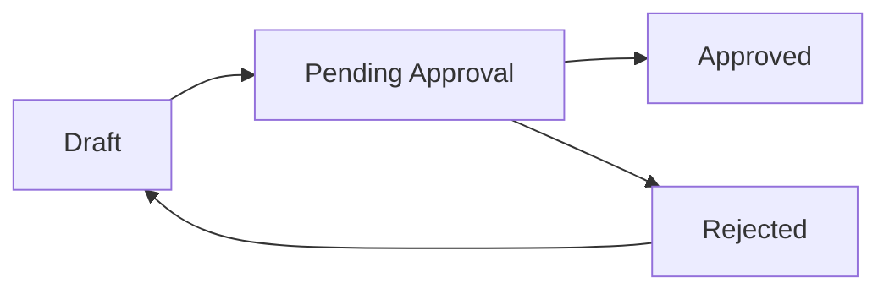

# Procurement Overview

The Procurement module manages purchase orders (POs) for materials. Create POs for suppliers, track approval status, and link them to sample materials.

---

## PO Number Format

**Format:** `PO-YYYY-XXX`

| Part | Meaning | Example |
|------|---------|---------|
| `PO` | Purchase Order prefix | PO |
| `YYYY` | Year created | 2026 |
| `XXX` | Sequential number | 001, 002, 088 |

**Example:** `PO-2026-088` = The 88th purchase order created in 2026

<Info>
PO numbers are generated automatically when you create a new purchase order. You cannot change the PO number after creation.
</Info>

---

## PO Statuses

| Status | Meaning | What Can Be Done |
|--------|---------|------------------|
| Draft | Being created, not submitted | Edit, delete, submit |
| Pending Approval | Submitted, waiting for approver | View only (unless approver) |
| Approved | Approved by authorizer | View, download |
| Rejected | Rejected, needs revision | Edit, resubmit |

### Status Flow

---

## PO Categories

| Category | Use For |
|----------|---------|
| Leather | Main leather materials |
| Accessories | Hardware, zips, buckles |
| Lining | Interior materials |
| Mixed | Multiple material types |
| Other | Miscellaneous purchases |

---

## Navigation

**Location:** Sidebar → **Procurement** (or **Purchase Orders**)

### PO List Page

Shows all purchase orders with columns:

| Column | Description |
|--------|-------------|
| PO Number | PO-YYYY-XXX |
| Supplier | Supplier name |
| Category | Material category |
| Total | Total cost (PKR) |
| Status | Current status |
| Created | Date created |

### Filters Available

| Filter | Options |
|--------|---------|
| Status | Draft, Pending, Approved, Rejected |
| Category | Leather, Accessories, Lining, Mixed, Other |
| Supplier | Select supplier |
| Date Range | Created date range |

---

## Key Features

<CardGroup cols={2}>
  <Card title="Create Purchase Orders" icon="plus">
    Create POs for material purchases from suppliers
  </Card>
  <Card title="Approval Workflow" icon="check">
    Submit POs for approval based on authorization limits
  </Card>
  <Card title="Link to Samples" icon="link">
    Connect POs to sample materials for tracking
  </Card>
  <Card title="Document Management" icon="file-pdf">
    Upload and store PO documents
  </Card>
</CardGroup>

---

## Quick Actions

| Action | Location |
|--------|----------|
| Create new PO | Procurement → + New PO |
| View PO details | Click on PO row |
| Approve pending PO | PO Detail → Approve button |
| Submit for approval | PO Detail → Submit button |

---

## Related Guides

<CardGroup cols={2}>
  <Card title="PO Detail Page" icon="rectangle-list" href="/procurement/po-detail">
    Complete page guide
  </Card>
  <Card title="Creating Purchase Orders" icon="plus" href="/procurement/purchase-orders">
    How to create POs
  </Card>
  <Card title="Approval Workflow" icon="check" href="/procurement/approval-workflow">
    Understanding approvals
  </Card>
  <Card title="Suppliers" icon="truck-field" href="/procurement/suppliers">
    Managing supplier information
  </Card>
</CardGroup>
