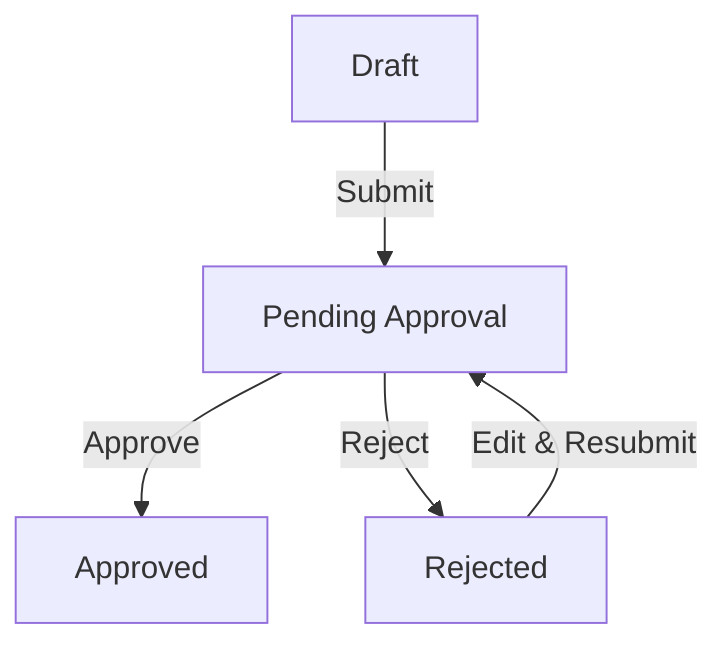

# PO Detail Page

This guide explains every section of the Purchase Order Detail page—where to find information, what each field means, and how to perform actions.

**Access:** Sidebar → Procurement → Click on any PO

---

## PO Number

### Format

**`PO-YYYY-XXX`**

| Part | Meaning | Example |
|------|---------|---------|
| `PO` | Purchase Order prefix | PO |
| `YYYY` | Year created | 2026 |
| `XXX` | Sequential number | 001, 088, 142 |

**Example:** `PO-2026-088` = The 88th purchase order created in 2026

### How It's Generated

- Automatic when you create a new PO
- Sequential within each year
- Resets to 001 at start of each year
- Cannot be changed after creation

---

## Header Section

The header displays key PO information and action buttons.

### Information Displayed

| Element | Description |
|---------|-------------|
| PO Number | PO-YYYY-XXX format |
| Supplier | Supplier name |
| Status Badge | Draft / Pending Approval / Approved / Rejected |
| Total Cost | Sum of all items (PKR) |

### Action Buttons

| Button | What It Does | Who Sees It | When Available |
|--------|--------------|-------------|----------------|
| Edit | Modify PO details | Creator | Draft or Rejected status |
| Submit | Send for approval | Creator | Draft status |
| Approve | Approve the PO | Approvers | Pending Approval |
| Reject | Reject the PO | Approvers | Pending Approval |
| Delete | Remove the PO | Creator | Draft status only |
| Download | Download PO document | Everyone | Any status |

---

## Overview Tab

**Location:** PO Detail → Overview (default tab)

Shows basic purchase order information.

### Fields

| Field | What It Shows |
|-------|---------------|
| PO Number | PO-YYYY-XXX |
| Supplier | Supplier name |
| Category | Leather / Accessories / Lining / Mixed / Other |
| Total Cost | Sum of all items (PKR) |
| Status | Current approval status |
| Created By | User who created the PO |
| Created Date | When the PO was created |
| Notes | Additional information |

### Editing

<Steps>
  <Step title="Click Edit button">
    In header area (only available if Draft or Rejected)
  </Step>
  <Step title="Update fields">
    Modify supplier, category, notes, etc.
  </Step>
  <Step title="Save">
    Click Save to apply changes
  </Step>
</Steps>

<Warning>
You can only edit a PO when it's in **Draft** or **Rejected** status. Once submitted for approval, it's locked.
</Warning>

---

## Items Tab

**Location:** PO Detail → Items tab

Shows all material items included in this purchase order.

### Columns Displayed

| Column | What It Shows |
|--------|---------------|
| Description | Item description |
| Quantity | Amount being ordered |
| Unit | Unit of measure (pcs, m, kg, etc.) |
| Unit Rate | Price per unit (PKR) |
| Total | Quantity × Unit Rate |

### Adding Items

<Steps>
  <Step title="Go to Items tab">
    PO Detail → Items
  </Step>
  <Step title="Click Add Item">
    Opens item form
  </Step>
  <Step title="Enter item details">
    Description, quantity, unit rate
  </Step>
  <Step title="Save">
    Item added to PO
  </Step>
</Steps>

### Editing Items

<Steps>
  <Step title="Find the item">
    In the Items list
  </Step>
  <Step title="Click Edit icon">
    Pencil icon on the row
  </Step>
  <Step title="Update details">
    Modify quantity, rate, etc.
  </Step>
  <Step title="Save">
    Changes applied
  </Step>
</Steps>

### Removing Items

<Steps>
  <Step title="Find the item">
    In the Items list
  </Step>
  <Step title="Click Delete icon">
    Trash icon on the row
  </Step>
  <Step title="Confirm">
    Item removed from PO
  </Step>
</Steps>

<Info>
Items can only be added, edited, or removed when PO is in **Draft** or **Rejected** status.
</Info>

---

## Documents Tab

**Location:** PO Detail → Documents tab

Manage uploaded PO documents.

### Document List

| Column | Description |
|--------|-------------|
| Document Name | File name |
| Type | PDF, image, etc. |
| Uploaded By | Who uploaded |
| Date | Upload date |
| Actions | Download, Delete |

### Uploading Documents

<Steps>
  <Step title="Go to Documents tab">
    PO Detail → Documents
  </Step>
  <Step title="Click Upload">
    Opens file selector
  </Step>
  <Step title="Select file">
    Choose PDF or image
  </Step>
  <Step title="Confirm">
    Document uploaded
  </Step>
</Steps>

### Supported Formats

| Format | Accepted |
|--------|----------|
| PDF | Yes |
| JPG/JPEG | Yes |
| PNG | Yes |
| XLSX/XLS | Yes |

---

## Linked Sample/Material

**Location:** PO Detail → Overview tab → Linked Sample section

Shows which sample and material this PO is for.

### Information Displayed

| Field | Description |
|-------|-------------|
| Sample | Sample number (SMP-YYYY-XXX) |
| Material Type | Leather / Accessories / Lining |
| Sample Status | Current sample status |

### Actions

- Click sample number to open the sample
- Link shows automatically when PO is created from a sample material

<Info>
When you create a PO from a sample's material section, the link is created automatically. You don't need to link manually.
</Info>

---

## Approval Section

**Location:** PO Detail → Overview tab → Approval section

Shows approval status and history.

### Current Status Display

| Field | Description |
|-------|-------------|
| Status | Current approval status |
| Required Approver | Who needs to approve (based on limits) |
| Amount | Total PO amount |
| Limit Info | Which approval limit applies |

### Approval History

| Column | Description |
|--------|-------------|
| Action | Submitted / Approved / Rejected |
| By | User who took action |
| Date | When action was taken |
| Comments | Any notes added |

### For Approvers

If you have approval permissions and the PO is pending:

<Steps>
  <Step title="Review PO details">
    Check items, amounts, supplier
  </Step>
  <Step title="Click Approve or Reject">
    Buttons in header or approval section
  </Step>
  <Step title="Add comments (optional)">
    Especially if rejecting, explain why
  </Step>
  <Step title="Confirm">
    Action is recorded
  </Step>
</Steps>

---

## Activity Tab

**Location:** PO Detail → Activity tab

Complete history of all changes to this PO.

### Events Logged

| Event Type | What's Recorded |
|------------|-----------------|
| Created | PO creation |
| Edited | Field changes |
| Items Added/Removed | Item changes |
| Submitted | Sent for approval |
| Approved | Approval action |
| Rejected | Rejection with reason |
| Documents | Upload/delete actions |

---

## Status Explained

| Status | What It Means | What You Can Do |
|--------|---------------|-----------------|
| Draft | Being prepared, not submitted | Edit all fields, add/remove items, delete PO |
| Pending Approval | Waiting for approver | View only (creator), Approve/Reject (approvers) |
| Approved | Approved, ready to proceed | View, download documents |
| Rejected | Rejected, needs changes | Edit, fix issues, resubmit |

### Status Flow

---

## Common Scenarios

| Situation | Action |
|-----------|--------|
| Need to change amount | Edit button → Update items → Save (if Draft/Rejected) |
| PO was rejected | Check rejection reason in Activity → Edit → Fix issues → Submit again |
| Who needs to approve? | Check Approval section → Shows required approver |
| Link PO to sample | Created automatically when PO made from sample material |
| Download PO document | Documents tab → Download button |
| Need to add more items | Items tab → Add Item (if Draft/Rejected) |
| Check approval history | Approval section or Activity tab |

---

## Troubleshooting

<AccordionGroup>
  <Accordion title="Can't edit PO">
    **Cause:** PO is in Pending Approval or Approved status.

    **Solution:** You can only edit when status is Draft or Rejected. If Pending, wait for approval decision or ask approver to reject so you can edit.
  </Accordion>

  <Accordion title="Approve button not showing">
    **Cause:** You don't have approval permissions, or PO is not pending.

    **Solution:**
    1. Check PO status is "Pending Approval"
    2. Verify you have approval permissions for this amount
    3. Contact admin if you should have approval rights
  </Accordion>

  <Accordion title="PO over my approval limit">
    **Cause:** Total amount exceeds your authorization limit.

    **Solution:** A higher-level approver is needed. Check the Approval section to see who can approve this amount.
  </Accordion>

  <Accordion title="Submit button not showing">
    **Cause:** PO is not in Draft status, or missing required fields.

    **Solution:**
    1. Check status is Draft
    2. Ensure all required fields are filled
    3. Ensure at least one item is added
  </Accordion>

  <Accordion title="Can't delete PO">
    **Cause:** PO is not in Draft status.

    **Solution:** Only Draft POs can be deleted. Once submitted, POs are permanent records.
  </Accordion>

  <Accordion title="Items showing wrong total">
    **Cause:** Calculation not refreshed.

    **Solution:** Refresh page. Total = Sum of (Quantity × Unit Rate) for all items.
  </Accordion>

  <Accordion title="Linked sample not showing">
    **Cause:** PO was created manually, not from a sample.

    **Solution:** Manual POs don't auto-link. The link is only created when PO is generated from a sample's material section.
  </Accordion>
</AccordionGroup>

---

## Related Guides

<CardGroup cols={2}>
  <Card title="Creating Purchase Orders" icon="plus" href="/procurement/purchase-orders">
    How to create new POs
  </Card>
  <Card title="Approval Workflow" icon="check" href="/procurement/approval-workflow">
    Understanding the approval process
  </Card>
  <Card title="Suppliers" icon="truck-field" href="/procurement/suppliers">
    Managing supplier information
  </Card>
</CardGroup>
