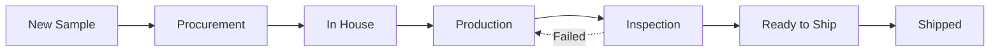
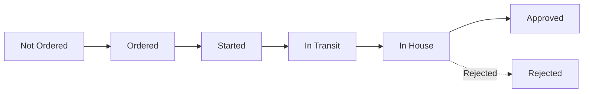
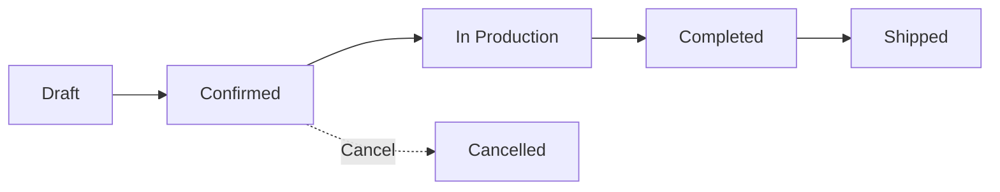
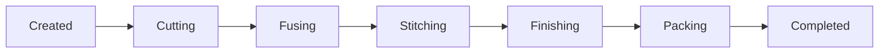
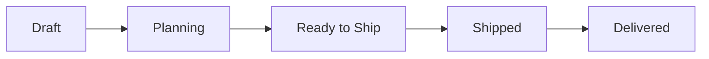
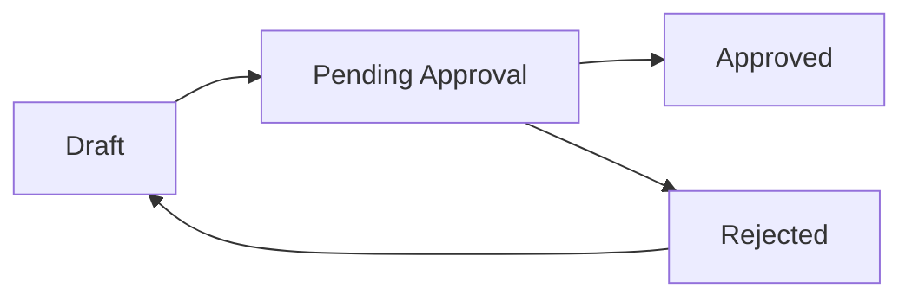

# Status Workflows

Complete reference for all status workflows in the system. Each section shows the flow diagram, status meanings, and how statuses are set.

---

## Sample Statuses

### Flow Diagram



### Status Reference

| Status | Meaning | Set By |
|--------|---------|--------|
| New Sample | Sample created, awaiting material orders | Auto on creation |
| Procurement | Materials being ordered/sourced | Manual or auto when PO created |
| In House | Materials received, ready for production | Manual when materials arrive |
| Production | Sample being manufactured | Manual when production starts |
| Inspection | Quality check in progress | Manual when production complete |
| Ready to Ship | Passed inspection, awaiting shipment | Manual after QC pass |
| Shipped | Sample dispatched to customer | Manual when shipped |

### Transitions

| From | To | Trigger |
|------|-----|---------|
| New Sample | Procurement | Create PO for materials |
| Procurement | In House | Mark materials received |
| In House | Production | Start production |
| Production | Inspection | Complete production |
| Inspection | Ready to Ship | Pass QC |
| Inspection | Production | Fail QC (rework) |
| Ready to Ship | Shipped | Mark as shipped |

---

## Material Statuses

### Flow Diagram



### Status Reference

| Status | Meaning | Set By |
|--------|---------|--------|
| Not Ordered | Material not yet ordered | Auto (default) |
| Ordered | PO created for material | Auto when PO submitted |
| Started | Supplier started production | Manual update |
| In Transit | Material shipped from supplier | Manual update |
| In House | Material received at facility | Manual on receipt |
| Approved | Material passed quality check | Manual after QC |
| Rejected | Material failed quality check | Manual after QC |

### Transitions

| From | To | Trigger |
|------|-----|---------|
| Not Ordered | Ordered | PO submitted for approval |
| Ordered | Started | Manual: supplier confirmed start |
| Started | In Transit | Manual: supplier shipped |
| In Transit | In House | Manual: goods received |
| In House | Approved | Manual: QC passed |
| In House | Rejected | Manual: QC failed |

---

## Production Order Statuses

### Flow Diagram



### Status Reference

| Status | Meaning | Set By |
|--------|---------|--------|
| Draft | Order created, not confirmed | Auto on creation |
| Confirmed | Order confirmed, ready for production | Manual confirmation |
| In Production | Manufacturing in progress | Auto when job cards start |
| Completed | All units manufactured | Auto when all job cards complete |
| Shipped | Order dispatched | Auto when added to shipment |
| Cancelled | Order cancelled | Manual |

### Transitions

| From | To | Trigger |
|------|-----|---------|
| Draft | Confirmed | Confirm order |
| Draft | Cancelled | Cancel order |
| Confirmed | In Production | First job card started |
| Confirmed | Cancelled | Cancel order |
| In Production | Completed | All job cards complete |
| Completed | Shipped | Added to shipped shipment |

---

## Job Card Stages

### Flow Diagram



### Stage Reference

| Stage | Meaning | Set By |
|-------|---------|--------|
| Created | Job card generated | Auto on creation |
| Cutting | Leather being cut | QR scan or manual |
| Fusing | Fusing/reinforcement | QR scan or manual |
| Stitching | Assembly/stitching | QR scan or manual |
| Finishing | Final touches, hardware | QR scan or manual |
| Packing | Packaging for shipment | QR scan or manual |
| Completed | All stages done | Auto after packing |

### Transitions

| From | To | Trigger |
|------|-----|---------|
| Created | Cutting | Start cutting (scan/manual) |
| Cutting | Fusing | Complete cutting |
| Fusing | Stitching | Complete fusing |
| Stitching | Finishing | Complete stitching |
| Finishing | Packing | Complete finishing |
| Packing | Completed | Complete packing |

### Stage Tracking

| Method | How It Works |
|--------|--------------|
| QR Scan | Worker scans job card QR at each station |
| Manual | Supervisor updates stage in system |
| Batch | Multiple job cards updated together |

---

## Shipment Statuses

### Flow Diagram



### Status Reference

| Status | Meaning | Set By |
|--------|---------|--------|
| Draft | Shipment created, adding orders | Auto on creation |
| Planning | Carton planning in progress | Manual |
| Ready to Ship | All planning complete, documents ready | Manual |
| Shipped | Dispatched to customer | Manual with tracking |
| Delivered | Customer received goods | Manual confirmation |

### Transitions

| From | To | Trigger |
|------|-----|---------|
| Draft | Planning | Start carton planning |
| Planning | Ready to Ship | Complete planning, generate docs |
| Ready to Ship | Shipped | Enter tracking, mark shipped |
| Shipped | Delivered | Confirm delivery |

### Required for Each Transition

| Transition | Requirements |
|------------|--------------|
| Draft → Planning | At least one order added |
| Planning → Ready to Ship | Cartons planned, documents generated |
| Ready to Ship → Shipped | Carrier and tracking number entered |
| Shipped → Delivered | Delivery confirmation |

---

## Purchase Order Statuses

### Flow Diagram



### Status Reference

| Status | Meaning | Set By |
|--------|---------|--------|
| Draft | PO being prepared | Auto on creation |
| Pending Approval | Submitted, awaiting approver | Auto on submit |
| Approved | Approved by authorizer | Manual by approver |
| Rejected | Rejected, needs revision | Manual by approver |

### Transitions

| From | To | Trigger |
|------|-----|---------|
| Draft | Pending Approval | Submit for approval |
| Pending Approval | Approved | Approver approves |
| Pending Approval | Rejected | Approver rejects |
| Rejected | Draft | Edit PO (implicit) |
| Rejected | Pending Approval | Resubmit after edit |

### Approval Requirements

| Transition | Requirements |
|------------|--------------|
| Draft → Pending | Supplier selected, items added |
| Pending → Approved | Approver has sufficient limit |
| Pending → Rejected | Approver adds rejection reason |

---

## Status Color Codes

Standard colors used throughout the system:

| Color | Meaning | Used For |
|-------|---------|----------|
| Gray | Not started / Draft | Draft, Not Ordered, Created |
| Blue | In progress | Procurement, In Transit, Planning |
| Yellow | Awaiting action | Pending Approval, Inspection |
| Green | Complete / Approved | Approved, Completed, Delivered |
| Red | Rejected / Failed | Rejected, Cancelled |
| Purple | Shipped | Shipped status |

---

## Quick Reference

### Sample → Production Flow

```
Sample (SMP) → Production Order (PRD) → Job Cards (JC) → Shipment (SHP)
```

### Material Flow

```
Not Ordered → Ordered → Started → In Transit → In House → Approved
```

### Approval Flow

```
Draft → Pending Approval → Approved/Rejected
```
