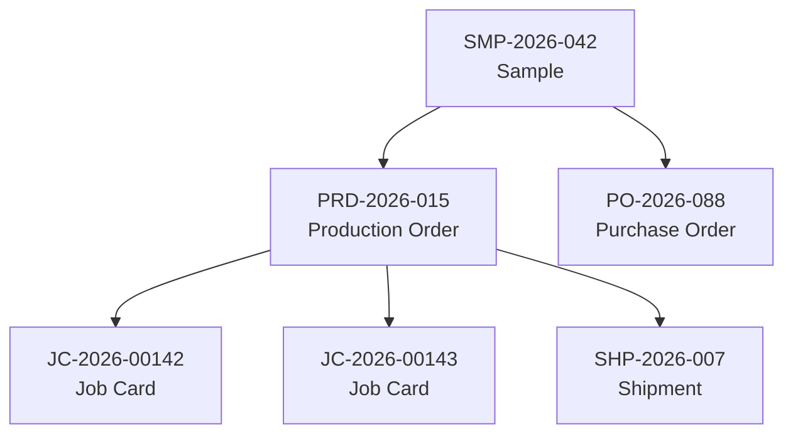

# System Codes

All records in Mac Leather Dashboard are identified by unique system-generated codes. This reference explains each code format.

---

## Code Summary

| Code | Full Name | Format | Example |
|------|-----------|--------|---------|
| SMP | Sample | SMP-YYYY-XXX | SMP-2026-042 |
| PRD | Production Order | PRD-YYYY-XXX | PRD-2026-015 |
| JC | Job Card | JC-YYYY-XXXXX | JC-2026-00142 |
| PO | Purchase Order | PO-YYYY-XXX | PO-2026-088 |
| SHP | Shipment | SHP-YYYY-XXX | SHP-2026-007 |

---

## SMP - Sample Code

### Format

**`SMP-YYYY-XXX`**

| Part | Meaning | Values |
|------|---------|--------|
| SMP | Sample prefix | Fixed |
| YYYY | Year created | 2024, 2025, 2026... |
| XXX | Sequential number | 001-999 |

### Examples

| Code | Meaning |
|------|---------|
| SMP-2026-001 | First sample created in 2026 |
| SMP-2026-042 | 42nd sample created in 2026 |
| SMP-2025-156 | 156th sample created in 2025 |

### Generation Rules

| Rule | Description |
|------|-------------|
| Automatic | Generated when sample is created |
| Sequential | Increments by 1 for each new sample |
| Year Reset | Resets to 001 on January 1st |
| Immutable | Cannot be changed after creation |
| Unique | No duplicates within same year |

---

## PRD - Production Order Code

### Format

**`PRD-YYYY-XXX`**

| Part | Meaning | Values |
|------|---------|--------|
| PRD | Production prefix | Fixed |
| YYYY | Year created | 2024, 2025, 2026... |
| XXX | Sequential number | 001-999 |

### Examples

| Code | Meaning |
|------|---------|
| PRD-2026-001 | First production order in 2026 |
| PRD-2026-015 | 15th production order in 2026 |
| PRD-2025-203 | 203rd production order in 2025 |

### Generation Rules

| Rule | Description |
|------|-------------|
| Automatic | Generated when production order is created |
| Sequential | Increments by 1 for each new order |
| Year Reset | Resets to 001 on January 1st |
| Immutable | Cannot be changed after creation |
| Linked | May reference source sample (SMP code) |

---

## JC - Job Card Code

### Format

**`JC-YYYY-XXXXX`**

| Part | Meaning | Values |
|------|---------|--------|
| JC | Job Card prefix | Fixed |
| YYYY | Year created | 2024, 2025, 2026... |
| XXXXX | Sequential number | 00001-99999 |

### Examples

| Code | Meaning |
|------|---------|
| JC-2026-00001 | First job card in 2026 |
| JC-2026-00142 | 142nd job card in 2026 |
| JC-2025-05678 | 5,678th job card in 2025 |

### Generation Rules

| Rule | Description |
|------|-------------|
| Automatic | Generated when job card is created |
| Sequential | Increments by 1 for each new job card |
| 5-Digit | Uses 5 digits (higher volume than other codes) |
| Year Reset | Resets to 00001 on January 1st |
| Parent Link | Always linked to a production order (PRD) |

### Why 5 Digits?

Job cards are created more frequently than other records. A single production order may generate multiple job cards (one per size, per batch, etc.), so the numbering supports up to 99,999 per year.

---

## PO - Purchase Order Code

### Format

**`PO-YYYY-XXX`**

| Part | Meaning | Values |
|------|---------|--------|
| PO | Purchase Order prefix | Fixed |
| YYYY | Year created | 2024, 2025, 2026... |
| XXX | Sequential number | 001-999 |

### Examples

| Code | Meaning |
|------|---------|
| PO-2026-001 | First purchase order in 2026 |
| PO-2026-088 | 88th purchase order in 2026 |
| PO-2025-142 | 142nd purchase order in 2025 |

### Generation Rules

| Rule | Description |
|------|-------------|
| Automatic | Generated when PO is created |
| Sequential | Increments by 1 for each new PO |
| Year Reset | Resets to 001 on January 1st |
| Immutable | Cannot be changed after creation |
| Link Optional | May link to sample material |

---

## SHP - Shipment Code

### Format

**`SHP-YYYY-XXX`**

| Part | Meaning | Values |
|------|---------|--------|
| SHP | Shipment prefix | Fixed |
| YYYY | Year created | 2024, 2025, 2026... |
| XXX | Sequential number | 001-999 |

### Examples

| Code | Meaning |
|------|---------|
| SHP-2026-001 | First shipment in 2026 |
| SHP-2026-007 | 7th shipment in 2026 |
| SHP-2025-089 | 89th shipment in 2025 |

### Generation Rules

| Rule | Description |
|------|-------------|
| Automatic | Generated when shipment is created |
| Sequential | Increments by 1 for each new shipment |
| Year Reset | Resets to 001 on January 1st |
| Immutable | Cannot be changed after creation |
| Contains | Links to production orders being shipped |

---

## Code Relationships

| From | To | Relationship |
|------|----|--------------|
| Sample | Production Order | Sample approved → Production order created |
| Sample | Purchase Order | Material needed → PO created from sample |
| Production Order | Job Card | Order split into job cards for production |
| Production Order | Shipment | Completed orders grouped into shipment |

---

## Quick Lookup

### By Prefix

| Prefix | Go To |
|--------|-------|
| SMP | Samples section |
| PRD | Production section |
| JC | Production → Job Cards |
| PO | Procurement section |
| SHP | Exports section |

### Finding a Record

1. Note the code prefix (SMP, PRD, JC, PO, SHP)
2. Go to the relevant section
3. Use search or filter by code
4. Or use global search (Ctrl/Cmd + K)

---

## Common Questions

| Question | Answer |
|----------|--------|
| Can I change a code? | No, codes are immutable after creation |
| What if we exceed 999? | System uses 4 digits (0001-9999) automatically |
| Why do codes reset yearly? | Easier to track volume and find records by year |
| Can codes have gaps? | Yes, if records are deleted (rare) |
| Are codes globally unique? | Unique per year per type |
