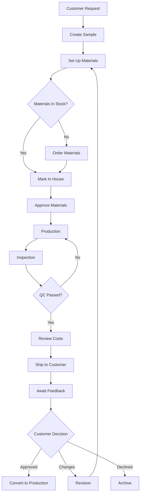
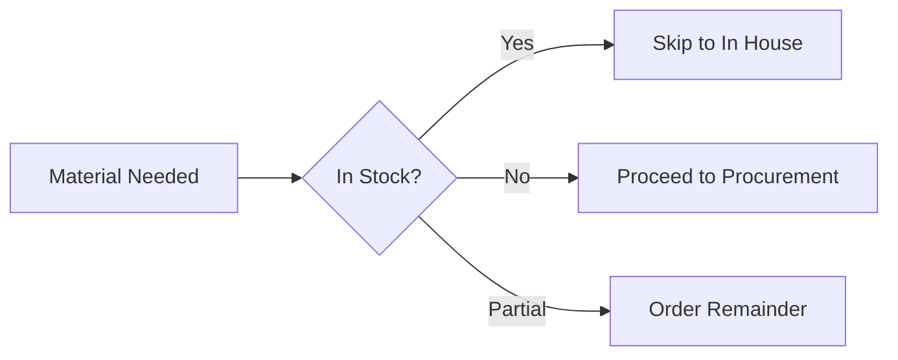
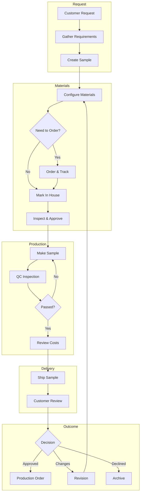

# Sample Workflow: Start to Finish

This guide walks you through the complete journey of a sample—from the moment a customer makes a request to the final outcome. Whether you're new to the system or want a refresher, follow along step by step.

<Note>
**Timeline varies**

A typical sample takes 2-4 weeks from request to customer delivery. Complex samples with custom materials or multiple revisions can take longer. Always communicate realistic timelines to your customer.
</Note>

## Complete Workflow Overview

---

## Phase 1: Receiving a Sample Request

When a customer reaches out about a new sample, your first job is gathering the right information. A few minutes of good questions now saves days of back-and-forth later.

### Information to Gather

| Category | What to Ask |
|----------|-------------|
| **Product** | What type of product? Bag, wallet, belt, accessory? |
| **Style** | Design references, sketches, or images? |
| **Materials** | Leather type? Color preferences? Hardware finish? |
| **Size** | Dimensions? Multiple sizes needed? |
| **Timeline** | When do they need the sample? |
| **Budget** | Any target price point? |

### Questions to Ask Before Starting

- Is this a new design or a modification of something existing?
- Do you have a tech pack or specification sheet?
- Are there specific materials you want us to source, or should we recommend?
- Is this for a specific season or launch date?
- How many sample units do you need?

<Warning>
**Red Flags to Watch For**

- **Unrealistic timelines**: "I need it in 3 days" for a complex item
- **Vague specifications**: "Just make something nice"
- **No reference materials**: Makes it hard to meet expectations
- **Constantly changing requirements**: Get sign-off before starting

Address these upfront. It's better to clarify now than remake the sample twice.
</Warning>

---

## Phase 2: Creating the Sample in the System

Once you have enough information, create the sample record.

<Steps>
  <Step title="Navigate to Samples">
    From the main menu, click **Samples**, then click **New Sample** in the top right.
  </Step>
  <Step title="Fill in the basic details">
    - **Customer**: Select from the dropdown (if new customer, contact admin to add them first)
    - **Style Name**: Be descriptive. "Black Crossbody Bag with Gold Hardware" beats "Bag 1"
    - **Delivery Date**: When the customer needs it. Add a few days buffer
    - **Quantity**: Usually 1-2 for samples
    - **Notes**: Any special requirements or context
  </Step>
  <Step title="Click Create">
    The system will:
    - Generate a unique sample number
    - Create three material entries (Leather, Accessories, Lining)
    - Set status to "New Sample"
    - Start the activity log
  </Step>
  <Step title="Upload initial files">
    Immediately after creation, go to the **Files** tab and upload:
    - Customer worksheet or tech pack (category: Worksheets)
    - Reference images (category: Images)
    - Any email briefs or notes (category: Comments)
  </Step>
</Steps>

<Tip>
Don't skip the file uploads. Three months from now when the customer asks "what did we agree on?", you'll be glad everything is documented.
</Tip>

---

## Phase 3: Setting Up Materials

Every sample needs three material types configured. Even if one isn't applicable (e.g., no lining on a belt), still review each entry.

### For Each Material Type

<AccordionGroup>
  <Accordion title="Leather">
    Key specifications to enter:
    - **Type**: Full grain, top grain, PU, bonded
    - **Color**: Name and Pantone reference if available
    - **Thickness**: In mm (e.g., 1.2mm)
    - **Finish**: Matte, glossy, embossed, smooth
    - **Supplier**: If you know who can provide it
    - **Unit Rate**: Cost per unit (sq ft, piece, etc.)
  </Accordion>
  <Accordion title="Accessories">
    Hardware and trims:
    - **Type**: Zipper, buckle, snap, D-ring, etc.
    - **Brand/Model**: YKK #5, etc.
    - **Finish**: Gold, silver, antique brass, gunmetal
    - **Specifications**: Size, weight, any special features
    - **Unit Rate**: Cost per piece
  </Accordion>
  <Accordion title="Lining">
    Interior materials:
    - **Type**: Cotton, polyester, suede, etc.
    - **Weight**: GSM if known
    - **Color**: Should complement or contrast with leather
    - **Composition**: 100% cotton, poly blend, etc.
    - **Unit Rate**: Cost per meter or yard
  </Accordion>
</AccordionGroup>

### Decision Point: Stock or Order?

If you already have the material in the warehouse, you can skip ahead and mark it as "In House" immediately.

---

## Phase 4: Procurement - Ordering Materials

For materials you need to order, follow this process.

<Steps>
  <Step title="Update status to Ordered">
    Open the material card and change status from "Not Ordered" to **Ordered**. Fill in:
    - **Supplier**: Who you're ordering from
    - **Unit Rate**: Agreed price
    - **Quantity**: How much you need
    - **Expected Delivery**: When it should arrive
    - **PO Number**: If you have one
  </Step>
  <Step title="Create or upload Purchase Order">
    If a formal PO is needed:
    - Create it in the procurement module, OR
    - Upload an existing PO document to the sample's Files (category: Purchase Orders)

    The PO may need approval depending on your company's workflow.
  </Step>
  <Step title="Track the order">
    Update the status as the order progresses:
    - **Started**: Supplier confirms they're working on it
    - **In Transit**: Material has shipped
    - **Delay**: If there's a significant hold-up (add notes explaining why)
  </Step>
</Steps>

### Handling Procurement Issues

| Issue | Action |
|-------|--------|
| Supplier can't deliver | Find alternative supplier, update the record |
| Price changed | Update unit_rate, add note explaining change |
| Quality concerns from supplier | Document concerns, consider backup options |
| Delivery delayed | Update expected date, communicate to customer if it affects timeline |

<Info>
Keep notes updated as things change. Your future self (and colleagues) will thank you when questions arise later.
</Info>

---

## Phase 5: Receiving Materials

When materials arrive at the factory, don't just update the system—inspect first.

<Steps>
  <Step title="Physical inspection">
    Before marking anything as received:
    - Check against the specifications you ordered
    - Verify quantities match
    - Look for defects, damage, or color variations
    - Take photos for your records
  </Step>
  <Step title="Update system to In House">
    If the material looks good:
    - Change status to **In House**
    - Record the actual delivery date
    - Add notes about condition if relevant
  </Step>
  <Step title="Quality decision">
    Make the call:
    - **Good to use** → Change status to **Approved**
    - **Minor issues but usable** → Approve with notes
    - **Not acceptable** → Keep as "In House" and contact supplier, OR mark as **Sent Back** if returning
  </Step>
</Steps>

<Info>
**Automatic Status Update**

When all three materials (Leather, Accessories, Lining) reach **Approved** status, the sample automatically moves from "New Sample" or "Procurement" to **In House**. This signals that production can begin.
</Info>

---

## Phase 6: Sample Production

With all materials approved and in-house, it's time to make the sample.

<Steps>
  <Step title="Prepare for production">
    - Confirm all materials are physically available (not just system status)
    - Review the specifications one more time
    - Brief the pattern master or production team on any special requirements
  </Step>
  <Step title="Update sample status">
    Change the sample status from "In House" to **Production**. Add a note about:
    - Who is making it
    - Expected completion date
  </Step>
  <Step title="Monitor progress">
    During production:
    - Check in on progress
    - Answer any questions from the production team
    - Document any decisions or changes made
  </Step>
  <Step title="Production complete">
    When the physical sample is finished:
    - Update status to **Inspection**
    - The sample is ready for quality check
  </Step>
</Steps>

<Warning>
**Don't Rush This Phase**

A rushed sample often means a rejected sample. It's better to take an extra day and get it right than ship something that makes the customer question your quality.
</Warning>

---

## Phase 7: Quality Inspection

Before anything goes to the customer, it gets inspected.

<Steps>
  <Step title="Internal QC check">
    Review the sample against:
    - Original specifications and tech pack
    - Workmanship standards (stitching, edges, finishing)
    - Material quality (matches what was approved)
    - Functionality (zippers work, snaps close properly)
  </Step>
  <Step title="Document results">
    - Take final photos from multiple angles
    - Upload to Files (category: Images)
    - Note any minor deviations from spec (and whether they're acceptable)
  </Step>
  <Step title="Pass or fail">
    - **Passed** → Continue to shipping preparation
    - **Failed** → Return to production with specific feedback on what needs fixing
  </Step>
</Steps>

<Tip>
Take photos in good lighting against a neutral background. These images may end up in customer presentations or production references.
</Tip>

---

## Phase 8: Costing Review

Before marking the sample ready to ship, review the costs. This is your last chance to ensure the numbers are right.

<Steps>
  <Step title="Open Landed Cost section">
    On the sample detail page, find the **Landed Cost** card. Review:
    - Materials costs (should be populated from your material entries)
    - Labor rates (stitcher_rate and fuser_rate)
    - Any additional costs
  </Step>
  <Step title="Update rates if needed">
    Based on actual production:
    - Was this more complex than expected? Adjust rates accordingly
    - These rates will carry over if the sample converts to production
  </Step>
  <Step title="Profitability check">
    Compare your total cost to:
    - What you quoted the customer (if applicable)
    - Target margins for this product type

    Flag any concerns now—it's easier to discuss with the customer before production than after.
  </Step>
</Steps>

---

## Phase 9: Shipping the Sample

Time to get the sample to the customer.

<Steps>
  <Step title="Prepare for shipping">
    - Update status to **Ready to Ship**
    - Package the sample appropriately (protect it!)
    - Include any documentation: spec sheets, care cards, your business card
  </Step>
  <Step title="Arrange shipment">
    - For local: Use your standard courier
    - For international: May need to create an export shipment with proper documentation
    - Record the courier and tracking number
  </Step>
  <Step title="Update and notify">
    - Change status to **Shipped**
    - Add tracking information to notes
    - Send the customer an email with tracking details
  </Step>
</Steps>

---

## Phase 10: Awaiting Feedback

The sample is in transit. Now you wait.

- Monitor delivery status
- Follow up with the customer 2-3 days after delivery
- Document any feedback in the sample notes
- Upload any marked-up images or comments from the customer to Files

<Tip>
Don't just wait passively. A quick "Did you receive the sample? Any initial thoughts?" shows professionalism and keeps the conversation moving.
</Tip>

---

## Phase 11: Customer Decision

This is where the sample journey concludes—in one of three ways.

<AccordionGroup>
  <Accordion title="Outcome A: Approved → Convert to Production">
    The customer loves it and wants to proceed!

    **Step 1: Confirm production details**
    - Final quantities (with size breakdown if applicable)
    - Delivery timeline
    - Any small modifications from the sample
    - Pricing confirmation

    **Step 2: Convert to Production Order**
    - Click **Convert to Production** on the sample
    - Enter the size/quantity breakdown
    - Set the delivery date
    - Labor rates carry over automatically

    **Step 3: Sample lifecycle complete**
    - The sample record stays as a reference
    - A new production order is created and linked
    - Continue in the Production module
  </Accordion>

  <Accordion title="Outcome B: Changes Requested → Revision">
    The customer wants modifications before committing.

    **Step 1: Document the changes**
    - Add detailed notes on what needs changing
    - Upload any marked-up images from the customer
    - Clarify anything ambiguous before starting

    **Step 2: Decide on approach**
    - **Minor changes**: Modify the existing sample
    - **Major changes**: May need to create a new sample

    **Step 3: If modifying same sample**
    - Update status back to the appropriate phase
    - Update material specs if needed
    - Re-order materials if required
    - Go through production and inspection again

    **Step 4: If creating new sample**
    - Create a new sample record
    - Reference the original in the notes (e.g., "Revision of SAMPLE-001")
    - Start from Phase 2 with the new requirements
  </Accordion>

  <Accordion title="Outcome C: Declined → Archive">
    It happens. Not every sample converts.

    **Step 1: Understand why**
    - Document the reason: price, timing, design, found alternative?
    - This helps improve future quotes and designs

    **Step 2: Archive the sample**
    - Change status to **Archived** (or use your company's equivalent)
    - Add final notes summarizing the outcome

    **Step 3: Learn from it**
    - What could have been done differently?
    - Were there early warning signs?
    - Any feedback to share with the team?
  </Accordion>
</AccordionGroup>

---

## Handling Special Situations

Real life doesn't always follow the happy path. Here's how to handle common complications.

### Sample On Hold

**When**: Waiting for customer decision, material availability issues, capacity constraints

**How**: Change sample status to **On Hold**

**What to do**:
- Add notes explaining why it's on hold
- Set a reminder to follow up
- Communicate with the customer if they're affected

**Resolution**: Change back to the appropriate active status when the hold is resolved

### Significant Delays

**When**: Sample is running behind the expected timeline

**What to do**:
- Update expected dates in the system
- Communicate proactively with the customer
- Identify the bottleneck and address it
- Document what caused the delay (helps prevent repeat issues)

### Material Sent Back

**When**: Material failed inspection and needs to return to supplier

**How**: Change material status to **Sent Back**

**Impact**: Sample typically goes on hold until replacement arrives

**Next steps**:
- Contact supplier immediately
- Document the quality issue (photos help)
- Arrange replacement
- Consider backup suppliers for future

### Urgent/Rush Samples

Some samples need to jump the queue.

- Mark urgency clearly in notes
- Communicate with the production team
- Don't skip quality steps—parallel processing is fine, shortcuts on QC aren't
- Keep the customer updated more frequently than usual

<Warning>
Rush requests should be the exception, not the rule. If every sample is "urgent," nothing is.
</Warning>

---

## Complete Workflow Summary

---

## Quick Reference Checklist

Use this to track progress on any sample:

- [ ] Sample request received and requirements documented
- [ ] Sample created in system with correct details
- [ ] Customer worksheet/specs uploaded to Files
- [ ] All three material specifications entered
- [ ] Materials ordered (if not in stock)
- [ ] Materials received and physically inspected
- [ ] All materials marked as Approved
- [ ] Sample status moved to Production
- [ ] Sample manufactured
- [ ] QC inspection completed and passed
- [ ] Landed cost reviewed and rates confirmed
- [ ] Sample shipped with tracking provided to customer
- [ ] Customer feedback received and documented
- [ ] Final outcome recorded: **Production** / **Revision** / **Archived**

---

## Related Guides

<CardGroup cols={2}>
  <Card title="Creating Samples" icon="plus" href="/samples/creating-samples">
    Detailed field reference for sample creation
  </Card>
  <Card title="Material Workflow" icon="arrows-rotate" href="/samples/material-workflow">
    In-depth guide to material statuses
  </Card>
  <Card title="Uploading Files" icon="upload" href="/samples/uploading-files">
    File management and best practices
  </Card>
  <Card title="Landed Costs" icon="calculator" href="/samples/landed-costs">
    Understanding sample costing
  </Card>
  <Card title="Sample to Production" icon="arrow-right-to-bracket" href="/samples/sample-to-production">
    Conversion process details
  </Card>
  <Card title="Samples Overview" icon="swatchbook" href="/samples/overview">
    Quick reference for the samples module
  </Card>
</CardGroup>
