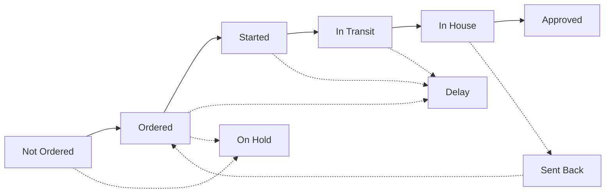

# Sample Workflow Guide

This guide covers how to use Sample Flow Nexus to manage samples. It explains system codes, field definitions, status meanings, and step-by-step procedures.

---

## System Codes

### Sample Number Format

All samples are assigned an automatic number: **`SMP-YYYY-XXX`**

| Part | Meaning | Example |
|------|---------|---------|
| `SMP` | Sample prefix | SMP |
| `YYYY` | Year created | 2026 |
| `XXX` | Sequential number (resets each year) | 001, 002, 003... |

**Example:** `SMP-2026-042` = The 42nd sample created in 2026

### Other System Codes

| Code | Record Type | Example |
|------|-------------|---------|
| `SMP` | Sample | SMP-2026-001 |
| `PRD` | Production Order | PRD-2026-001 |
| `PO` | Purchase Order | PO-2026-001 |
| `JC` | Job Card | JC-2026-001 |

---

## Sample Statuses

### Status Reference

| Status | Meaning | How It's Set |
|--------|---------|--------------|
| New Sample | Sample created, no materials ordered | Automatic on creation |
| Procurement | At least one material is being ordered | Automatic when any material → "Ordered" |
| In House | All materials received and approved | Automatic when all 3 materials → "Approved" |
| Production | Sample is being manufactured | Manual |
| Inspection | Sample complete, undergoing QC | Manual |
| Ready to Ship | Passed QC, awaiting dispatch | Manual |
| Shipped | Sent to customer | Manual |
| On Hold | Paused | Manual |
| Delay | Behind schedule | Manual, or automatic if past delivery date |

### Automatic Status Changes

<Info>
**The system changes sample status automatically in these cases:**

1. When you change **any material** to "Ordered" → Sample becomes **"Procurement"**
2. When **all three materials** are "Approved" → Sample becomes **"In House"**

You don't need to manually update the sample status in these situations.
</Info>

---

## Creating a Sample

**Location:** Sidebar → Samples → **+ New Sample** button

### Form Fields

| Field | Required | What to Enter |
|-------|----------|---------------|
| Customer | Yes | Select from dropdown |
| Style Name | Yes | Descriptive name for this sample |
| Delivery Date | Yes | Target completion date |
| Quantity | Yes | Number of sample units |
| Notes | No | Additional information |
| Stitcher Rate | No | Labor rate for stitching (PKR) |
| Fuser Rate | No | Labor rate for fusing (PKR) |

<Info>
**What the system does when you click Save:**

1. Generates sample number (SMP-YYYY-XXX)
2. Creates 3 material records: Leather, Accessories, Lining
3. Sets all material statuses to "Not Ordered"
4. Sets sample status to "New Sample"
5. Logs creation in Activity tab
6. Redirects to Sample Detail page
</Info>

---

## Sample Detail Page

### Page Layout

**Header Section:**
- Sample number (e.g., SMP-2026-042)
- Style name
- Customer name
- Status badge
- Action buttons

**Action Buttons:**

| Button | What It Does |
|--------|--------------|
| Edit | Open edit form for sample details |
| Change Status | Open status dropdown |
| Archive | Archive this sample |
| Move to Production | Convert to production order (only visible when all materials approved) |

**Tabs:**

| Tab | Contents |
|-----|----------|
| Overview | Basic info, dates, notes, labor rates |
| Materials | The 3 material cards |
| Files | Uploaded documents and images |
| Activity | History of all changes |

**Below Tabs:** Landed Cost card

---

## Materials Section

**Location:** Sample Detail → Materials tab

### The Three Materials

Every sample has exactly 3 materials (created automatically):

| Material | Purpose |
|----------|---------|
| Leather | Main outer material |
| Accessories | Hardware, zips, buckles, trims |
| Lining | Interior material |

### Editing a Material

1. Click on the material card
2. Edit dialog opens
3. Update fields
4. Click Save

### Common Fields (All Materials)

| Field | Description |
|-------|-------------|
| Status | Current status in workflow |
| Supplier | Supplier name |
| Unit Rate | Cost per unit (PKR) |
| Quantity | Amount needed |
| Expected Delivery | When you expect it |
| Actual Delivery | When it arrived |
| Notes | Additional notes |

### Leather-Specific Fields

| Field | Options/Format |
|-------|----------------|
| Leather Type | Full Grain, Top Grain, Split, PU, Bonded |
| Color | Text field |
| Pantone Shade | Pantone code (e.g., 19-4052) |
| Thickness | Number in mm (e.g., 1.2) |
| Finish | Matte, Glossy, Semi-Gloss, Embossed |

### Accessories-Specific Fields

| Field | Options/Format |
|-------|----------------|
| Accessory Type | Zipper, Buckle, Snap, D-Ring, Rivet, Clasp, Other |
| Brand | Text field (e.g., YKK) |
| Model | Text field (e.g., #5 Metal) |
| Specifications | Text field for details |

### Lining-Specific Fields

| Field | Options/Format |
|-------|----------------|
| Lining Type | Cotton, Polyester, Suede, Satin, Canvas |
| Weight | Number in GSM |
| Composition | Text field (e.g., 100% Cotton) |

---

## Material Statuses

### Status Reference

| Status | Meaning | When to Use |
|--------|---------|-------------|
| Not Ordered | Default state | Material not yet ordered |
| Ordered | PO sent to supplier | After placing order |
| Started | Supplier is working on it | When supplier confirms production started |
| In Transit | Shipped from supplier | When tracking shows shipped |
| In House | Physically received at factory | When material arrives |
| Approved | Passed quality check | After inspecting and accepting |
| Delay | Running late | When behind expected delivery |
| On Hold | Paused | When waiting on something |
| Sent Back | Returned to supplier | If material rejected |

### Status Flow



**Normal flow:** Not Ordered → Ordered → Started → In Transit → In House → Approved

**Exception paths:**
- Delay: Can occur from Ordered, Started, or In Transit
- Sent Back: From In House, returns to Ordered when replacement ships
- On Hold: Can pause from Not Ordered or Ordered

---

## Changing Statuses

### To Change Sample Status

<Steps>
  <Step title="Open sample">
    Go to Samples → Click on the sample
  </Step>
  <Step title="Click status badge or Change Status button">
    Located in the header area
  </Step>
  <Step title="Select new status">
    Choose from dropdown
  </Step>
  <Step title="Add note (optional)">
    Explain the change if needed
  </Step>
</Steps>

### To Change Material Status

<Steps>
  <Step title="Open sample">
    Go to Samples → Click on the sample
  </Step>
  <Step title="Go to Materials tab">
    Click Materials in the tab bar
  </Step>
  <Step title="Click on the material card">
    Leather, Accessories, or Lining
  </Step>
  <Step title="Change Status field">
    Select new status from dropdown
  </Step>
  <Step title="Update related fields">
    If changing to "Ordered": enter Supplier, Unit Rate, Expected Delivery
    If changing to "In House": enter Actual Delivery
  </Step>
  <Step title="Save">
    Click Save button
  </Step>
</Steps>

---

## Files Section

**Location:** Sample Detail → Files tab

### File Categories

| Category | Use For |
|----------|---------|
| Worksheets | Tech packs, specifications, patterns |
| Images | Product photos, reference images, swatches |
| Comments | Customer feedback, notes, markups |
| Purchase Orders | Supplier PO documents |

### Uploading Files

<Steps>
  <Step title="Go to Files tab">
    Sample Detail → Files
  </Step>
  <Step title="Click Upload or drag file">
    Upload button or drag-and-drop area
  </Step>
  <Step title="Select category">
    Choose: Worksheets, Images, Comments, or Purchase Orders
  </Step>
  <Step title="Add description (optional)">
    Brief description of the file
  </Step>
  <Step title="Click Upload">
    File uploads and appears in list
  </Step>
</Steps>

### Supported Formats

| Category | Formats |
|----------|---------|
| Worksheets | PDF, XLSX, XLS, DOCX, DOC |
| Images | PNG, JPG, JPEG, WEBP, GIF |
| Comments | PDF, DOCX, TXT |
| Purchase Orders | PDF, XLSX |

**Maximum file size:** 25MB

### File Versioning

When you upload a new version of a file:
- New file is marked as **Latest**
- Previous file is marked as **Previous**
- Both versions are kept

To upload a new version: Click on existing file → **Upload New Version**

---

## Landed Cost Section

**Location:** Sample Detail page → Landed Cost card (below tabs)

### Fields

| Field | Description | Editable |
|-------|-------------|----------|
| Materials Cost | Sum of all 3 material costs | Auto-calculated |
| Stitcher Rate | Rate per unit for stitching | Yes |
| Fuser Rate | Rate per unit for fusing | Yes |
| Labor Cost | (Stitcher + Fuser) × Quantity | Auto-calculated |
| Additional Costs | Other costs you add | Yes |
| Total Cost | Materials + Labor + Additional | Auto-calculated |
| Per Unit Cost | Total ÷ Quantity | Auto-calculated |

### Currency Display

Costs display in both:
- **PKR** (Pakistani Rupee) - primary
- **GBP** (British Pound) - converted

Exchange rate shown at top of card and updates automatically.

### Calculation

```
Materials Cost = Leather cost + Accessories cost + Lining cost
Labor Cost = (Stitcher Rate × Qty) + (Fuser Rate × Qty)
Total Cost = Materials + Labor + Additional
Per Unit = Total ÷ Quantity
```

---

## Converting to Production

**Button Location:** Sample Detail → Header → **Move to Production**

<Warning>
**Prerequisite:** All three materials must have status "Approved" before this button appears.
</Warning>

### Conversion Steps

<Steps>
  <Step title="Verify materials">
    Check all 3 materials show "Approved" status
  </Step>
  <Step title="Click Move to Production">
    Button in sample header
  </Step>
  <Step title="Enter production details">
    - Quantity (total units)
    - Size breakdown (if applicable)
    - Delivery date
    - Customer PO number
  </Step>
  <Step title="Confirm">
    Click Confirm to create production order
  </Step>
</Steps>

### What Gets Created

<Info>
**The system automatically:**

1. Creates new production order (PRD-YYYY-XXX)
2. Copies sample details, material specs, labor rates
3. Links production order to this sample
4. Sample remains viewable as reference
</Info>

---

## Common Scenarios

| Situation | Action in App |
|-----------|---------------|
| Material arrived at factory | Materials tab → Click material → Status = "In House" → Save |
| Material passed inspection | Materials tab → Click material → Status = "Approved" → Save |
| Supplier reports delay | Materials tab → Click material → Status = "Delay" → Update Expected Delivery → Save |
| Material failed QC | Materials tab → Click material → Status = "Sent Back" → Add note → Save |
| Need to pause sample | Header → Change Status → "On Hold" → Add note |
| Sample manufacturing started | Header → Change Status → "Production" |
| Sample finished, needs QC | Header → Change Status → "Inspection" |
| Sample passed QC | Header → Change Status → "Ready to Ship" |
| Sample dispatched | Header → Change Status → "Shipped" → Add tracking to notes |
| Customer approved, ready for bulk | Header → Move to Production → Enter details → Confirm |
| Customer wants changes | Add note with changes → Status = "On Hold" if pausing |
| Sample cancelled | Header → Archive → Select reason |

---

## Troubleshooting

| Problem | Cause | Solution |
|---------|-------|----------|
| "Move to Production" button not visible | Not all materials are "Approved" | Change all 3 materials to "Approved" status |
| Sample stuck on "New Sample" | No materials have been ordered | Change at least one material to "Ordered" |
| Sample stuck on "Procurement" | Materials not all approved | Approve remaining materials |
| Can't change material status | Dialog not saving | Check required fields are filled |
| File won't upload | File too large | Reduce file size to under 25MB |
| File won't upload | Unsupported format | Convert to supported format |
| Landed cost showing wrong | Material costs not entered | Enter Unit Rate and Quantity for each material |
| Customer not in dropdown | Customer not added to system | Contact admin to add customer |

---

## Quick Reference

### Button Locations

| Action | Location |
|--------|----------|
| Create new sample | Sidebar → Samples → + New Sample |
| Edit sample details | Sample Detail → Edit button |
| Change sample status | Sample Detail → Status badge or Change Status button |
| Edit material | Sample Detail → Materials tab → Click card |
| Upload file | Sample Detail → Files tab → Upload |
| View activity log | Sample Detail → Activity tab |
| Convert to production | Sample Detail → Move to Production button |
| Archive sample | Sample Detail → Archive button |

### Status Colors

| Status | Color |
|--------|-------|
| New Sample | Gray |
| Procurement | Blue |
| In House | Purple |
| Production | Orange |
| Inspection | Yellow |
| Ready to Ship | Teal |
| Shipped | Green |
| On Hold | Gray |
| Delay | Red |

---

## Related Guides

<CardGroup cols={2}>
  <Card title="Creating Samples" icon="plus" href="/samples/creating-samples">
    Detailed field reference
  </Card>
  <Card title="Material Workflow" icon="arrows-rotate" href="/samples/material-workflow">
    Material status details
  </Card>
  <Card title="Uploading Files" icon="upload" href="/samples/uploading-files">
    File management guide
  </Card>
  <Card title="Landed Costs" icon="calculator" href="/samples/landed-costs">
    Cost calculation details
  </Card>
</CardGroup>
