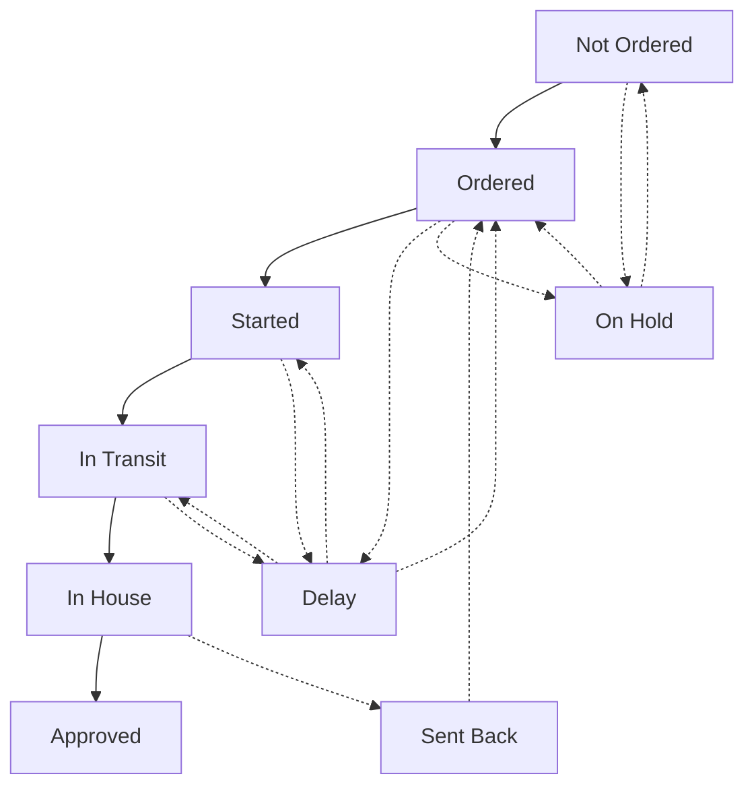

# Material Workflow

Every sample has three materials that need to be sourced: **Leather**, **Accessories**, and **Lining**. Each material moves through its own workflow independently.

## Status Flow

## Status Definitions

<Steps>
  <Step title="Not Ordered">
    Initial state. Material hasn't been ordered from a supplier yet.
  </Step>
  <Step title="Ordered">
    Purchase order sent to supplier. Waiting for them to begin work.
  </Step>
  <Step title="Started">
    Supplier has begun preparing or manufacturing the material.
  </Step>
  <Step title="In Transit">
    Material shipped from supplier. On its way to the factory.
  </Step>
  <Step title="In House">
    Material arrived at the factory. Ready for quality inspection.
  </Step>
  <Step title="Approved">
    Quality check passed. Material is ready to use in production.
  </Step>
</Steps>

## Special Statuses

<AccordionGroup>
  <Accordion title="Delay">
    Use when a supplier has reported a delay. The material will return to its previous status once the delay is resolved.

    Common reasons: stock issues, production backlog, shipping delays.
  </Accordion>
  <Accordion title="On Hold">
    Use when you're pausing procurement. Perhaps waiting for customer confirmation or evaluating alternatives.

    Materials on hold won't progress until you manually resume them.
  </Accordion>
  <Accordion title="Sent Back">
    Use when material failed quality check and needs to be returned to the supplier.

    After marking as Sent Back, the material returns to Ordered status when the replacement is dispatched.
  </Accordion>
</AccordionGroup>

## Updating Material Status

<Steps>
  <Step title="Open the sample">
    Go to **Samples** and click on the sample you want to update.
  </Step>
  <Step title="Find the Materials section">
    Scroll to the **Materials** card showing Leather, Accessories, and Lining.
  </Step>
  <Step title="Click the status badge">
    Click on the current status badge next to any material.
  </Step>
  <Step title="Select new status">
    Choose the new status from the dropdown. Add any notes if needed.
  </Step>
</Steps>

## Supplier Information

Each material can store supplier details:

| Field | Description |
|-------|-------------|
| Supplier | Company providing the material |
| PO Number | Purchase order reference |
| Expected Date | When you expect delivery |
| Notes | Additional details or instructions |

<Info>
**Auto-Status Update**

When all three materials reach **Approved** status, the sample automatically moves to **In House** status. This triggers the next phase of sample development.
</Info>

## Tips

<Tip>
Update material statuses as soon as you receive updates from suppliers. This keeps the whole team informed and helps identify bottlenecks early.
</Tip>

<Warning>
Don't skip statuses. Moving directly from "Ordered" to "Approved" loses valuable tracking information and makes it harder to audit the procurement process.
</Warning>
