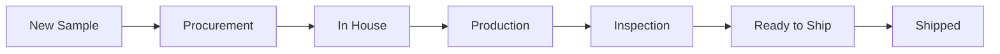

# What is a Sample?

A sample is a prototype version of a product created before committing to full production. Samples let you test materials, validate costs, and get customer approval before manufacturing begins.

Every sample moves through a defined lifecycle from creation to shipping.

## Sample Lifecycle

| Status | What's happening |
|--------|------------------|
| **New Sample** | Sample created, awaiting material orders |
| **Procurement** | Materials being sourced from suppliers |
| **In House** | All materials received and approved |
| **Production** | Sample being manufactured |
| **Inspection** | Quality check in progress |
| **Ready to Ship** | Passed QC, awaiting dispatch |
| **Shipped** | Sent to customer |

## Key Components

<CardGroup cols={3}>
  <Card title="Materials" icon="layer-group">
    Each sample has three material types: **Leather**, **Accessories**, and **Lining**. Track each one from order to approval.
  </Card>
  <Card title="Files" icon="folder-open">
    Upload worksheets, images, comments, and purchase orders. Keep all documentation in one place.
  </Card>
  <Card title="Landed Cost" icon="calculator">
    Calculate the true cost including materials, labor, and extras. See costs in GBP and PKR.
  </Card>
</CardGroup>

## Quick Actions

From any sample, you can:

- Update material statuses as they progress
- Upload and manage files
- View and edit landed costs
- Convert approved samples to production orders

## Guides

<CardGroup cols={2}>
  <Card title="Creating Samples" icon="plus" href="/samples/creating-samples">
    Step-by-step guide to create a new sample
  </Card>
  <Card title="Material Workflow" icon="arrows-rotate" href="/samples/material-workflow">
    Understand how materials move through statuses
  </Card>
  <Card title="Uploading Files" icon="upload" href="/samples/uploading-files">
    Manage worksheets, images, and documents
  </Card>
  <Card title="Landed Costs" icon="calculator" href="/samples/landed-costs">
    Calculate and track sample costs
  </Card>
  <Card title="Sample to Production" icon="arrow-right-to-bracket" href="/samples/sample-to-production">
    Convert approved samples to production orders
  </Card>
</CardGroup>
