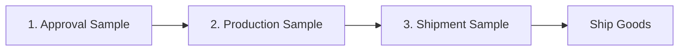

# 3 Types of Samples

Before we ship goods, we send **3 different samples** to the customer. Each sample has a different job.

---

## 1. Approval Sample

<Card title="What is it?" icon="circle-question">
The **first sample** you make. Send it to the customer. They check if they like the design.
</Card>

### When to make it
- **Before** production starts
- When you have a new design
- When customer asks for something new

### What customer checks
- Design looks correct
- Materials are good
- Size and fit is right
- Colour matches

### In the system
1. Go to **Samples**
2. Create new sample
3. Label says **"APPROVAL SAMPLE"**

<Warning>
**Important:** Do NOT start production until customer approves this sample!
</Warning>

---

## 2. Production Sample

<Card title="What is it?" icon="circle-question">
A sample from the **production line**. Shows customer that factory is making goods correctly.
</Card>

### When to make it
- **After** customer approves the first sample
- **After** you create a production order
- When production starts

### What customer checks
- Production quality is same as approval sample
- No defects
- Stitching is correct
- Materials match

### In the system
1. Go to **Production Orders**
2. Label says **"PRODUCTION SAMPLE"**

<Tip>
This is like a "test" - if there is a problem, fix it before making all the goods.
</Tip>

---

## 3. Shipment Sample

<Card title="What is it?" icon="circle-question">
A sample from the **finished goods**. Pick from the boxes before shipping. Shows customer the final quality.
</Card>

### When to make it
- **After** production is complete
- **Before** you ship the goods
- Pick from finished boxes

### What customer checks
- Final quality is good
- Packing is correct
- Labels are correct
- Ready to sell

### In the system
1. Go to **Exports**
2. Select **Shipment Sample** category

<Note>
**Keep 3 copies at factory** - 1 for customer, 1 for office, 1 for if there is any problem later.
</Note>

---

## Quick Reference

| Sample Type | When | Why |
|-------------|------|-----|
| **Approval** | Before production | Customer says "yes, make it" |
| **Production** | During production | Check factory is making correctly |
| **Shipment** | Before shipping | Final check before sending |

---

## Common Questions

<AccordionGroup>
  <Accordion title="Customer rejected production sample - what to do?">
    1. Find the problem
    2. Fix it
    3. Make new sample
    4. Send again
    5. Wait for approval

    **Do NOT continue production until approved.**
  </Accordion>

  <Accordion title="How many shipment samples to keep?">
    Keep **3 samples**:
    - 1 for customer
    - 1 for factory office
    - 1 for backup (if customer complains later)
  </Accordion>

  <Accordion title="Can I skip production sample?">
    **No.** Always make production sample. If you skip, you may have big problems later.
  </Accordion>
</AccordionGroup>

---

## Related Pages

<CardGroup cols={2}>
  <Card title="Creating Samples" icon="plus" href="/samples/creating-samples">
    How to make a new sample
  </Card>
  <Card title="Sample to Production" icon="arrow-right" href="/samples/sample-to-production">
    Move sample to production order
  </Card>
</CardGroup>
