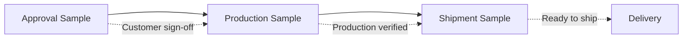

# Understanding Sample Types

In leather goods manufacturing, samples serve as critical checkpoints throughout the product lifecycle. Understanding when and why to use each sample type ensures quality, buyer confidence, and smooth production flow.

<Info>
On average, brands go through 5-7 rounds of sampling before final production. Each sample type serves a distinct purpose in quality assurance.
</Info>

---

## Why Samples Matter

Samples are more than just prototypes - they're quality gates that protect both manufacturer and buyer:

- **Risk Reduction**: Catch issues before committing to bulk production
- **Cost Control**: Fixing problems at sample stage costs a fraction of fixing them in production
- **Buyer Confidence**: Documented approval trail for compliance and dispute resolution
- **Quality Assurance**: Multiple checkpoints ensure consistency from design to delivery

---

## The Three Sample Types

---

## Approval Sample

The **Approval Sample** (also called development sample or proto sample) is the initial prototype sent to the customer for sign-off before production begins.

### Purpose

- Customer evaluates design, fit, materials, and construction
- Provides documented approval before committing to bulk production
- Establishes the benchmark for all future production

### When to Create

Create an approval sample during the **development phase**, before any production order exists. This is your first checkpoint with the buyer.

### In Mac Leather Dashboard

<Steps>
  <Step title="Create in Samples section">
    Navigate to **Samples** and create a new sample record
  </Step>
  <Step title="Track materials through procurement">
    Order and track leather, accessories, and lining materials
  </Step>
  <Step title="Ship for approval">
    When ready, create an export shipment with category **Approval Sample**
  </Step>
  <Step title="Label automatically set">
    Sample labels default to "APPROVAL SAMPLE" in the comments field
  </Step>
</Steps>

<Warning>
Production cannot begin until the approval sample is signed off by the customer. Never skip this step.
</Warning>

---

## Production Sample (PP Sample)

The **Production Sample** (Pre-Production sample) is the first sample made on the actual production line using final materials and processes.

### Purpose

- Verify the factory can replicate the approved sample at scale
- Test production line setup before bulk manufacturing
- Final quality check using actual production materials and workers

### When to Create

Create a production sample **after the production order is created**, during the manufacturing ramp-up phase. This is the factory's "test run."

### In Mac Leather Dashboard

<Steps>
  <Step title="Convert approved sample to production order">
    Use **Move to Production** from an approved sample, or create a standalone production order
  </Step>
  <Step title="Pull sample from production line">
    During initial production, select units for quality review
  </Step>
  <Step title="Ship for verification">
    Create an export shipment with category **Production Sample**
  </Step>
  <Step title="Label reflects production source">
    Production order labels default to "PRODUCTION SAMPLE" in the comments field
  </Step>
</Steps>

<Tip>
If the buyer rejects the production sample, you can identify and fix issues before the full batch is completed - saving significant rework costs.
</Tip>

---

## Shipment Sample

The **Shipment Sample** is selected from the completed production batch before dispatch, serving as final verification that quality has been maintained throughout production.

### Purpose

- Final quality check on finished goods
- Verify packing, folding, and finishing details
- Provide buyer assurance that the shipment matches expectations
- Create reference copies for future dispute resolution

### When to Create

Create a shipment sample **after production is complete**, before shipping approval is given. This is the last checkpoint before goods leave the factory.

### In Mac Leather Dashboard

<Steps>
  <Step title="Select from completed batch">
    Pick representative units from the finished production run
  </Step>
  <Step title="Create export shipment">
    Set the shipment category to **Shipment Sample**
  </Step>
  <Step title="Retain factory copies">
    Keep 2-3 samples at the factory for reference in case of customer complaints
  </Step>
</Steps>

<Note>
Many buyers require shipment sample approval before authorising the full shipment. The factory typically retains copies for future reference if any quality disputes arise.
</Note>

---

## Comparison Table

| Aspect | Approval Sample | Production Sample | Shipment Sample |
|--------|-----------------|-------------------|-----------------|
| **Stage** | Development | Manufacturing | Pre-dispatch |
| **Purpose** | Get customer sign-off | Verify production quality | Final QC before shipping |
| **Created from** | Sample record | Production Order | Completed batch |
| **Who reviews** | Buyer/Brand | Factory QC + Buyer | Buyer (final check) |
| **Label default** | "APPROVAL SAMPLE" | "PRODUCTION SAMPLE" | — |
| **System location** | Samples section | Production Orders | Export shipment category |

---

## Troubleshooting

<AccordionGroup>
  <Accordion title="When should I create each sample type?">
    **Approval Sample**: As soon as you have materials and specifications ready for a new product development.

    **Production Sample**: After the customer approves the design and you've created a production order.

    **Shipment Sample**: After bulk production is complete, before shipping.
  </Accordion>

  <Accordion title="What if the buyer rejects the production sample?">
    1. Document the rejection reason in the production order notes
    2. Make necessary adjustments to production process
    3. Create a new production sample for re-approval
    4. Do not proceed with bulk production until approved

    The production sample stage exists specifically to catch these issues early.
  </Accordion>

  <Accordion title="How many shipment samples should we keep?">
    Industry standard is to retain **3 copies**:
    - 1 for the buyer
    - 1 for the factory records
    - 1 for future reference/disputes

    Store factory copies in a clean, dry location with proper labelling.
  </Accordion>

  <Accordion title="Can I skip the production sample stage?">
    Not recommended. While some repeat orders with established suppliers may reduce sampling, skipping the production sample increases risk of:
    - Production defects going undetected
    - Costly rework on completed batches
    - Customer disputes and returns
  </Accordion>
</AccordionGroup>

---

## Related Guides

<CardGroup cols={2}>
  <Card title="Creating Samples" icon="plus" href="/samples/creating-samples">
    Step-by-step guide to create a new approval sample
  </Card>
  <Card title="Sample to Production" icon="arrow-right-to-bracket" href="/samples/sample-to-production">
    Convert approved samples to production orders
  </Card>
  <Card title="Export Shipments" icon="truck" href="/exports/overview">
    Create and manage shipments with sample categories
  </Card>
  <Card title="Complete Workflow" icon="diagram-project" href="/samples/complete-workflow">
    End-to-end sample lifecycle walkthrough
  </Card>
</CardGroup>
